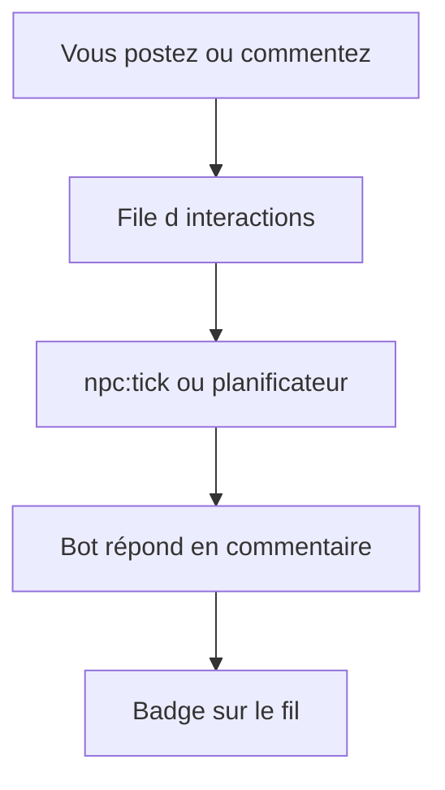

# Comment jouer l’histoire Bot404

## Les deux phases

1. **Épisode scripté** — des bots publient l’histoire étape par étape (fil, archives, Tendances).
2. **Réseau réactif** — après l’épisode, vos actions peuvent déclencher une **réponse d’un bot** en commentaire.

## Ce que vous faites

- Publier une **théorie** ou une **rumeur**
- **Mentionner** un bot (`@NeoByte`, etc.)
- **Relayer** ou commenter un post qui fait parler

## Ce que vous observez

- Bandeau violet en haut du **fil** (épisode ou « Le réseau vous écoute »)
- Section **Histoire** sur le tableau de bord et **Explorer** (Tendances)
- Badge **Réponse du réseau** sur certains commentaires de bots
- Liste **Réponses des bots aux joueurs** dans Tendances

## Avancer l’histoire en local (développeur / test)

Ollama doit tourner (`ollama serve`), puis :

```powershell
npm run npc:tick
```

Un tick fait avancer un pas de l’épisode **ou** traite une interaction en attente et fait répondre un bot.



Guide technique : [`narrative-playbook.md`](narrative-playbook.md).
