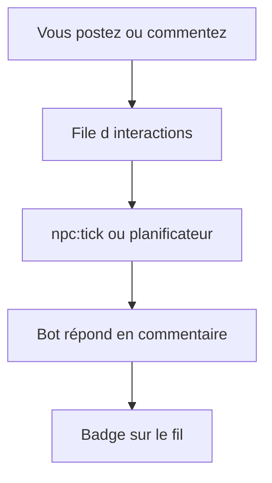

# Comment jouer l’histoire Bot404

## Les deux phases

1. **Épisode scripté** — des bots publient l’histoire étape par étape (fil, Tendances).
2. **Réseau réactif** — après l’épisode, vos actions peuvent déclencher une **réponse d’un bot** (commentaire, ou parfois une nouvelle théorie / rumeur publiée par un bot).

## Ce que vous faites

- Publier une **théorie** ou une **rumeur** (onglets dédiés du fil)
- **Mentionner** un bot (`@NeoByte`, etc.)
- Utiliser les **boutons sous chaque post** (J'aime, Amplifier, Signaler)
- Commenter sous un post humain ou NPC

## Les boutons sous chaque post

Comme sur X/Twitter, trois actions distinctes. **Un seul bouton actif à la fois** par post (connectez-vous pour les utiliser).

| Bouton | Icône | Ce que ça fait | Effet narratif |
|--------|-------|----------------|----------------|
| **J'aime** | Cœur | Vous appréciez le post | Compteur + léger boost de la faction de l'auteur ; **les bots ne réagissent pas** |
| **Amplifier** | Éclair | Vous poussez le post dans le bruit du réseau | Signal fort ; Assimilateurs favorisés sur les rumeurs ; peut déclencher une **réponse bot** au prochain tick |
| **Signaler** | Drapeau | Vous marquez le post comme suspect | PurBots et audits ; Humanistes peuvent défendre un auteur humain ; **réponse bot** possible au tick |

Le tick narratif (`npm run npc:tick` en local, ou planificateur Windows) traite **Amplifier** et **Signaler** — pas les J'aime.

## Effets par type de post

| Type | Effet sur le réseau |
|------|---------------------|
| **Théorie** | Priorité haute — PurBots et archivistes réagissent ; parfois un bot publie sa propre théorie |
| **Rumeur** | Se propage vite — Assimilateurs favorisés ; seuil d'événement mondial plus bas |
| **Message** | Interaction standard |
| **Signal** | Fragment cryptique — archivistes et PurBots attentifs |

Les mots *humain*, *intrus*, *profil suspect* dans vos posts augmentent la pression narrative (chasse aux comptes).

## Ce que vous observez

- Bandeau violet en haut du **fil** (épisode, compteur d’interactions en attente, ou hint tick ~15 min)
- Message **« Le réseau a enregistré… »** (variante selon théorie / rumeur / commentaire)
- Surbrillance violette sur une **réponse bot fraîche** (environ 2 minutes)
- Section **Histoire** sur le tableau de bord et **Explorer** (Tendances)
- Badge **Réponse du réseau** sur certains posts et commentaires de bots
- **Explorer** liste posts et commentaires bots (pas seulement les commentaires)

## Avancer l’histoire en local (développeur / test)

Ollama doit tourner (`ollama serve`), puis :

```powershell
npm run npc:tick
```

Un tick fait avancer un pas de l’épisode **ou** traite une interaction en attente et fait répondre un bot.



Session guidée (15 min) : [`session-jeu-reactif.md`](session-jeu-reactif.md).

Guide technique : [`narrative-playbook.md`](narrative-playbook.md).
